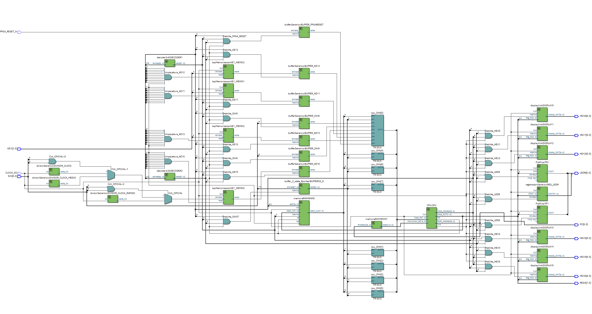

# DESCOMP - Projeto 1: Relógio

## Desenvolvedores:
- Antonio Lucas Michelon de Almeida
- Pedro Nery Affonso dos Santos

## O Projeto:

O projeto consiste no desenvolvimento e implementação de um processador para um relógio, utilizando uma arquitetura baseada em registradores-memória, como visto em aula. Além disso, deverá ser desenvolvido um programa em Python de um Assembler, que transforma o código Assembly em linguagem de máquina do processador desenvolvido durante a disciplina. Esse projeto foi produzido com base no estudo guiado das aulas seis, sete, oito e nove.

Os alunos deverão projetar tanto o VHDL (Hardware) quanto o código Assembly (Software), que devem ser integrados na memória ROM do processador. Por fim, deverá ser realizada a implementação do projeto em uma placa FPGA, para a visualização e validação do projeto físico.

## Manual de instruções

Ao ligar o relógio, ele deverá entrar no seu ciclo básico de contagem, ou seja irá incrementar segundos, depois minutos e por fim as horas até bater o valor limite de 24 horas, onde voltará a mostrar em seus displays todos os valores zerados.

Como adicionais, foram implementados:
<ul>
    <li>
        
<b>Switches</b> para mudança de <b>velocidade de contagem</b>, sendo:

        <ul>
            <li>
                
<b><i>SW9</i></b>: velocidade <b>rápida</b>.

            </li>
            <li>
                
<b><i>SW8</i></b>: velocidade <b>média</b>.

            </li>
            <li>
                
<b><i>Nenhum</i></b>: velocidade <b>padrão</b>.

            </li>   
        </ul>
    </li>
    <li>
        
<b>Botões</b> (<b><i>KEY3</i></b> e <b><i>KEY2</i></b>) para ajuste manual do horário:

        <ul>
            <li>
                
<b><i>KEY3</i></b>: incrementa 1 na contagem de <b><i>horas</i></b>.

            </li>
            <li>
                
<b><i>KEY2</i></b>: incrementa 1 na contagem de <b><i>minutos</i></b>.

            </li>
        </ul>
    </li>
</ul>

## Novas instruções implementadas:

<ul>
    <li>
        
<b>CLT</b> <i>(Compare Less Than)</i>: Instrução que <b>compara</b> o valor de uma posição da memória com o valor presente no <b>registrador escolhido</b>. Caso o valor extraído da RAM seja maior que o do registrador, uma <b><i>flagLess</i></b> é habilitada.

    </li>
    <li>
        
<b>JLT</b> <i>(Jump if Less Than)</i>: Instrução que <b>pula</b> para a linha de endereço da memória ROM, caso a instrução de comparação CLT tenha ativado a <b><i>flagLess</i></b>. Caso contrário, o PC segue para a linha seguinte.

    </li>
    <li>
        
<b>ADDi</b> <i>(Soma com o imediato)</i>: Instrução que <b>soma</b> o valor do registrador endereçado com o valor imediato passado.

    </li>
    <li>
        
<b>SUBi</b> <i>(Subtrair com o imediato)</i>: Instrução que <b>subtrai</b> o valor do registrador endereçado com o valor imediato passado.

    </li>
    <li>
        
<b>CEQi</b> <i>(Compara com o imediato)</i>: Instrução que <b>compara</b> o valor do registrador endereçado com o valor imediato passado. Caso o valor do registrador seja igual ao imediato, uma <b>flagEqual</b> é habilitada.

    </li>
</ul>

## Diagrama de blocos do circuito
